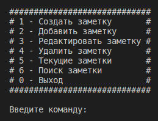
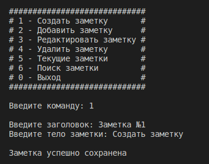
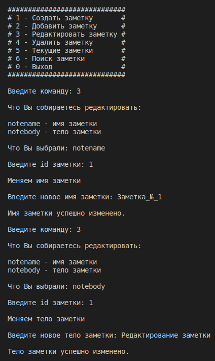
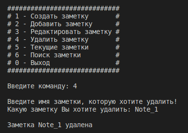
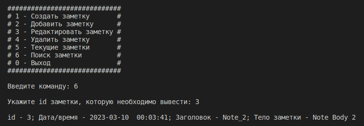
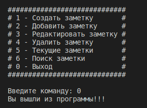

# Приложение заметки (Python)
___

## Menu

***
## Creating a note

***
## Add a note

***
## Editing a note

***
## Deletinga note

***
## Current notes

***
## Note search

***
## Exiting the application

***
***
***